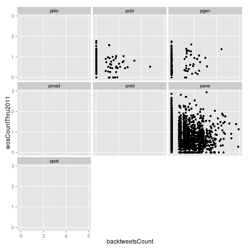
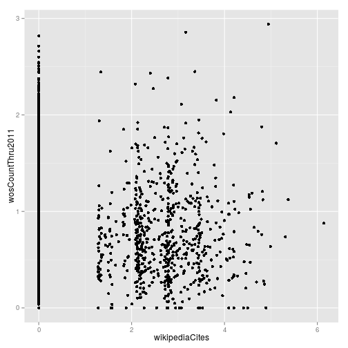
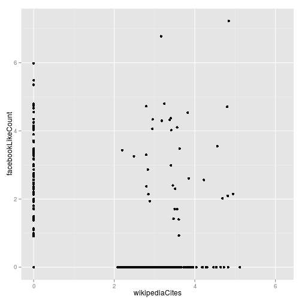

> ## Learning Objectives {.objectives}
>


```r
library("dplyr")
```

```
## 
## Attaching package: 'dplyr'
## 
## The following objects are masked from 'package:stats':
## 
##     filter, lag
## 
## The following objects are masked from 'package:base':
## 
##     intersect, setdiff, setequal, union
```


How does the total number of tweets change over the years?


```r
counts_raw %>%
  group_by(year) %>%
  summarize(total_tweets = sum(backtweetsCount))
```

```
## Source: local data frame [8 x 2]
## 
##   year total_tweets
## 1 2003            0
## 2 2004            5
## 3 2005           58
## 4 2006           25
## 5 2007          105
## 6 2008          209
## 7 2009         2246
## 8 2010         5422
```

And the Facebook likes?


```r
counts_raw %>%
  group_by(year) %>%
  summarize(total_tweets = sum(facebookLikeCount))
```

```
## Source: local data frame [8 x 2]
## 
##   year total_tweets
## 1 2003            0
## 2 2004           16
## 3 2005          112
## 4 2006           25
## 5 2007           67
## 6 2008          131
## 7 2009         1785
## 8 2010           NA
```


```r
counts_raw %>%
  group_by(year) %>%
  summarize(total_tweets = sum(facebookLikeCount, na.rm = TRUE))
```

```
## Source: local data frame [8 x 2]
## 
##   year total_tweets
## 1 2003            0
## 2 2004           16
## 3 2005          112
## 4 2006           25
## 5 2007           67
## 6 2008          131
## 7 2009         1785
## 8 2010         4933
```

In a function? How hard is it to convert this to use standard evaluation?


```r
test_se <- function(df, column) {
  x <- counts_raw %>%
  group_by_(~year) %>%
  summarize_(total_tweets = sum(facebookLikeCount, na.rm = TRUE))
}
```


```r
counts_raw %>%
  group_by(journal, year) %>%
  summarize(num = n())
```

```
## Source: local data frame [42 x 3]
## Groups: journal
## 
##    journal year num
## 1     pbio 2003  98
## 2     pbio 2004 454
## 3     pbio 2005 431
## 4     pbio 2006 422
## 5     pbio 2007 321
## 6     pbio 2008 327
## 7     pbio 2009 264
## 8     pbio 2010 274
## 9     pcbi 2005  72
## 10    pcbi 2006 168
## ..     ...  ... ...
```


```r
immuno <- filter(counts_raw, grepl("Immunology", plosSubjectTags))
```


```r
counts_raw %>%
  filter(grepl("Immunology", plosSubjectTags)) %>%
  group_by(journal, year) %>%
  summarize(num = n())
```

```
## Source: local data frame [42 x 3]
## Groups: journal
## 
##    journal year num
## 1     pbio 2003  10
## 2     pbio 2004  38
## 3     pbio 2005  27
## 4     pbio 2006  25
## 5     pbio 2007  16
## 6     pbio 2008  22
## 7     pbio 2009  17
## 8     pbio 2010  18
## 9     pcbi 2005   1
## 10    pcbi 2006  14
## ..     ...  ... ...
```

mean +/- sem


```r
tweets_per_journal <- counts_raw %>%
  group_by(journal) %>%
  summarize(mean = mean(backtweetsCount),
            sem = sd(backtweetsCount) / sqrt(n()),
            num = n())
```


```r
library("ggplot2")
```

```
## Loading required package: methods
```

```r
ggplot(tweets_per_journal, aes(x = journal, y = mean)) +
  geom_point() +
  geom_errorbar(aes(ymin = mean - sem, ymax = mean + sem)) +
  geom_text(aes(label = num), hjust = 1)
```

 


```r
tweets_per_journal <- counts_raw %>%
  group_by(journal, year) %>%
  summarize(mean = mean(backtweetsCount),
            sem = sd(backtweetsCount) / sqrt(n()),
            num = n())
```


```r
library("ggplot2")
ggplot(tweets_per_journal, aes(x = journal, y = mean)) +
  geom_point() +
  geom_errorbar(aes(ymin = mean - sem, ymax = mean + sem)) +
  geom_text(aes(label = num), hjust = 1) +
  facet_wrap(~year)
```

 


```r
ggplot(tweets_per_journal, aes(x = journal, y = mean)) +
  geom_bar(stat = "identity") +
  geom_errorbar(aes(ymin = mean - sem, ymax = mean + sem)) +
  geom_text(aes(label = num), hjust = 1) +
  facet_wrap(~year)
```

 

