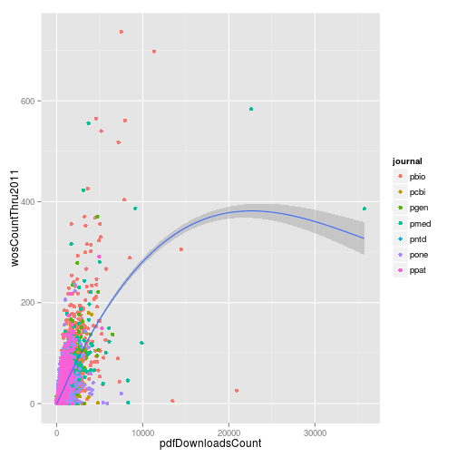
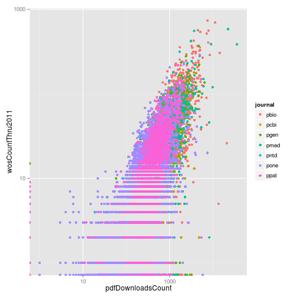
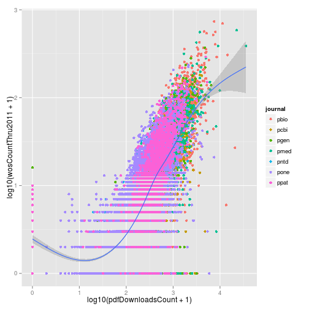
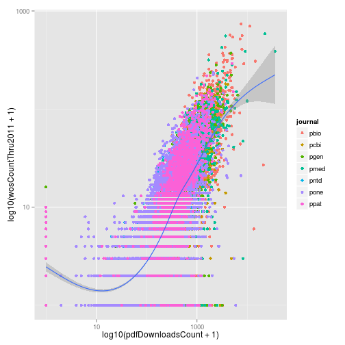
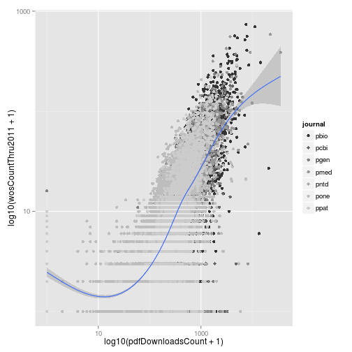
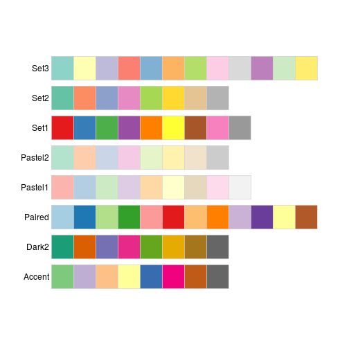
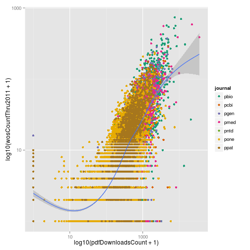

> ## Learning Objectives {.objectives}
>
> * Scales affect how data is mapped to aesthetics
> * Use variants of `scale_x_*` and `scale_y_*` to control axes
> * Use variants of `scale_color_*` to control color scheme

### Scales that affect mapping to x and y

~~~{.r}
p <- ggplot(research, aes(x = pdfDownloadsCount, y = wosCountThru2011)) +
  geom_point(aes(color = journal)) +
  geom_smooth()
p
~~~

~~~{.output}
geom_smooth: method="auto" and size of largest group is >=1000, so using gam with formula: y ~ s(x, bs = "cs"). Use 'method = x' to change the smoothing method.

~~~

~~~{.r}
p <- ggplot(research, aes(x = pdfDownloadsCount, y = wosCountThru2011)) +
  geom_point(aes(color = journal)) +
  geom_smooth() +
  scale_x_log10() +
  scale_y_log10()
p
~~~

~~~{.output}
geom_smooth: method="auto" and size of largest group is >=1000, so using gam with formula: y ~ s(x, bs = "cs"). Use 'method = x' to change the smoothing method.

~~~

~~~{.r}
p <- ggplot(research, aes(x = log10(pdfDownloadsCount + 1), y = log10(wosCountThru2011 + 1))) +
  geom_point(aes(color = journal)) +
  geom_smooth()
p
~~~

~~~{.output}
geom_smooth: method="auto" and size of largest group is >=1000, so using gam with formula: y ~ s(x, bs = "cs"). Use 'method = x' to change the smoothing method.

~~~

~~~{.r}
p <- ggplot(research, aes(x = log10(pdfDownloadsCount + 1), y = log10(wosCountThru2011 + 1))) +
  geom_point(aes(color = journal)) +
  geom_smooth()
p
~~~

~~~{.output}
geom_smooth: method="auto" and size of largest group is >=1000, so using gam with formula: y ~ s(x, bs = "cs"). Use 'method = x' to change the smoothing method.

~~~

~~~{.r}
p <- ggplot(research, aes(x = log10(pdfDownloadsCount + 1), y = log10(wosCountThru2011 + 1))) +
  geom_point(aes(color = journal)) +
  geom_smooth() +
  scale_x_continuous(breaks = c(1, 3), labels = c(10, 1000))
p
~~~

~~~{.output}
geom_smooth: method="auto" and size of largest group is >=1000, so using gam with formula: y ~ s(x, bs = "cs"). Use 'method = x' to change the smoothing method.

~~~

~~~{.r}
p <- ggplot(research, aes(x = log10(pdfDownloadsCount + 1), y = log10(wosCountThru2011 + 1))) +
  geom_point(aes(color = journal)) +
  geom_smooth() +
  scale_x_continuous(breaks = c(1, 3), labels = c(10, 1000)) +
  scale_y_continuous(breaks = c(1, 3), labels = c(10, 1000))
p
~~~

~~~{.output}
geom_smooth: method="auto" and size of largest group is >=1000, so using gam with formula: y ~ s(x, bs = "cs"). Use 'method = x' to change the smoothing method.

~~~

### Scales that affect mapping to color

~~~{.r}
p <- ggplot(research, aes(x = log10(pdfDownloadsCount + 1), y = log10(wosCountThru2011 + 1))) +
  geom_point(aes(color = journal)) +
  geom_smooth() +
  scale_x_continuous(breaks = c(1, 3), labels = c(10, 1000)) +
  scale_y_continuous(breaks = c(1, 3), labels = c(10, 1000)) +
  scale_color_grey()
p
~~~

~~~{.output}
geom_smooth: method="auto" and size of largest group is >=1000, so using gam with formula: y ~ s(x, bs = "cs"). Use 'method = x' to change the smoothing method.

~~~

~~~{.r}
p <- ggplot(research, aes(x = log10(pdfDownloadsCount + 1), y = log10(wosCountThru2011 + 1))) +
  geom_point(aes(color = journal)) +
  geom_smooth() +
  scale_x_continuous(breaks = c(1, 3), labels = c(10, 1000)) +
  scale_y_continuous(breaks = c(1, 3), labels = c(10, 1000)) +
  scale_color_manual(values = c("red", "yellow", "orange", "purple", "blue", "yellow", "pink"))
p
~~~

~~~{.output}
geom_smooth: method="auto" and size of largest group is >=1000, so using gam with formula: y ~ s(x, bs = "cs"). Use 'method = x' to change the smoothing method.

~~~

~~~{.r}
p <- ggplot(research, aes(x = log10(pdfDownloadsCount + 1), y = log10(wosCountThru2011 + 1))) +
  geom_point(aes(color = journal)) +
  geom_smooth() +
  scale_x_continuous(breaks = c(1, 3), labels = c(10, 1000)) +
  scale_y_continuous(breaks = c(1, 3), labels = c(10, 1000)) +
  scale_color_brewer(palette = "Dark2")
p
~~~

~~~{.output}
geom_smooth: method="auto" and size of largest group is >=1000, so using gam with formula: y ~ s(x, bs = "cs"). Use 'method = x' to change the smoothing method.

~~~

~~~{.r}
p <- ggplot(research, aes(x = log10(pdfDownloadsCount + 1), y = log10(wosCountThru2011 + 1))) +
  geom_point(aes(color = journal)) +
  geom_smooth() +
  scale_x_continuous(breaks = c(1, 3), labels = c(10, 1000)) +
  scale_y_continuous(breaks = c(1, 3), labels = c(10, 1000)) +
  scale_color_brewer(palette = "Dark2", labels = 1:7)
p
~~~

~~~{.output}
geom_smooth: method="auto" and size of largest group is >=1000, so using gam with formula: y ~ s(x, bs = "cs"). Use 'method = x' to change the smoothing method.

~~~

http://colorbrewer2.org/

### Challenge

> ## Citations versus days since publication {.challenge}

