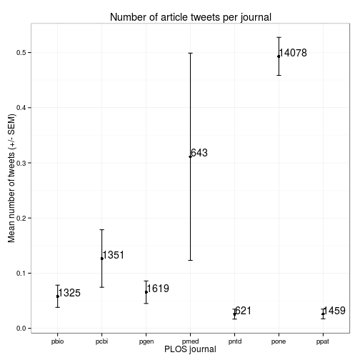
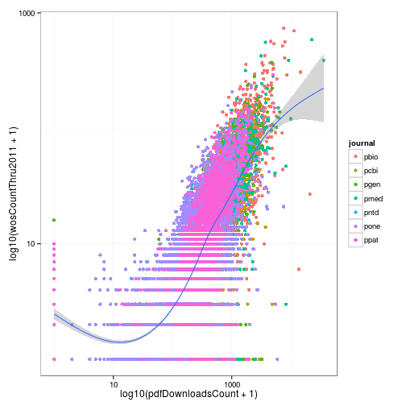
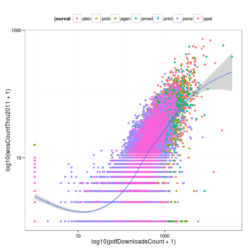
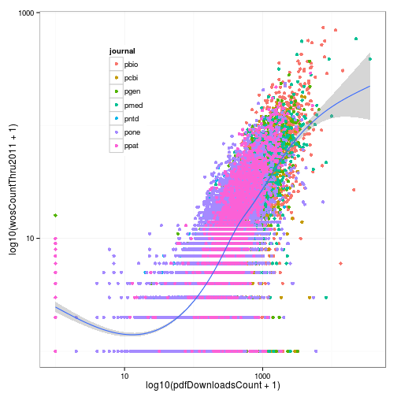

> ## Learning Objectives {.objectives}
>
> * Add title and axis labels to a plot
> * Use themes to change plot appearance
> * Modify the position of the legend

We have learned how to translate our data into a visualization using ggplot2.
However, we have not spent much time adjusting the plot appearance.
Not surprisingly, ggplot2 offers these capabilities as well.

### Labeling a plot

We can add a title and axis labels using the ggplot2 function `labs` (for labels).
Let's modify the plot we created in the last lesson that showed the mean number of article tweets per journal.

~~~{.r}
tweets_point <- ggplot(tweets_per_journal, aes(x = journal, y = mean)) +
  geom_point() + 
  geom_errorbar(aes(ymin = mean - sem, ymax = mean + sem), width = 0.1) +
  geom_text(aes(label = num), hjust = 0, vjust = 0) +
  labs(title = "Number of article tweets per journal",
       x = "PLOS journal", y = "Mean number of tweets (+/- SEM)")
tweets_point
~~~

### Using built-in themes

By default all ggplot2 graphics have a gray background with white gridlines.
This is known as `theme_gray()`, but we can easily change this if we have a different preference.
There are multiple other built-in themes that can be applied by adding them to the plot.

~~~{.r}
tweets_point + theme_minimal() # Minimal theme
~~~

~~~{.r}
tweets_point + theme_bw() # Black and white theme
~~~

~~~{.r}
tweets_point + theme_classic() # Classic theme
~~~

If we plan to make multiple plots that all need the same theme, we can use `theme_set` so that they are automatically applied to all plots.

~~~{.r}
theme_set(theme_bw())
tweets_point
~~~

### Modifying the legend

In theory, every aspect of the plot can be modified.
But memorizing how to control every feature of the plot is not worth the effect.
It can be quite complex, and you are likely only going to need to make a few changes.
Because ggplot2 is so popular, there are many online resources explaining how to accomplish specific tasks.

Here we'll show some common modifications of the legend.
We'll use our plot of 2011 citations versus PDF downloads.

~~~{.r}
p <- ggplot(research, aes(x = log10(pdfDownloadsCount + 1), y = log10(wosCountThru2011 + 1))) +
  geom_point(aes(color = journal)) +
  geom_smooth() +
  scale_x_continuous(breaks = c(1, 3), labels = c(10, 1000)) +
  scale_y_continuous(breaks = c(1, 3), labels = c(10, 1000))
p
~~~

~~~{.output}
geom_smooth: method="auto" and size of largest group is >=1000, so using gam with formula: y ~ s(x, bs = "cs"). Use 'method = x' to change the smoothing method.

~~~

By default the legend is placed to the right of the plot.
We can control this using the `legend.position` argument to `theme`.
We can use a key word like "left", "right", "top", or "bottom".

~~~{.r}
p + theme(legend.position = "top")
~~~

~~~{.output}
geom_smooth: method="auto" and size of largest group is >=1000, so using gam with formula: y ~ s(x, bs = "cs"). Use 'method = x' to change the smoothing method.

~~~

We can specify the position of the center of the legend relative to the entire plot, where (0, 0) is the bottom left and (1, 1) is the top right.

~~~{.r}
p + theme(legend.position = c(0.25, 0.75))
~~~

~~~{.output}
geom_smooth: method="auto" and size of largest group is >=1000, so using gam with formula: y ~ s(x, bs = "cs"). Use 'method = x' to change the smoothing method.

~~~

Or we can remove the legend.

~~~{.r}
p + theme(legend.position = "none")
~~~

~~~{.output}
geom_smooth: method="auto" and size of largest group is >=1000, so using gam with formula: y ~ s(x, bs = "cs"). Use 'method = x' to change the smoothing method.

~~~

Lastly, we can maintain the legend but remove only the legend title by setting the argument `legend.title` to `element_blank`.

~~~{.r}
p + theme(legend.title = element_blank())
~~~

~~~{.output}
geom_smooth: method="auto" and size of largest group is >=1000, so using gam with formula: y ~ s(x, bs = "cs"). Use 'method = x' to change the smoothing method.

~~~

The theme is composed of theme elements, e.g. `theme_text` controls the text appearance, `theme_line` controls the line appearance, etc.
This can be complicated, so it is best to use one of the built-in themes when first beginning to use ggplot2.
