> ## Learning Objectives {.objectives}
>

~~~{.r}
library("dplyr")
~~~

~~~{.output}

Attaching package: 'dplyr'

The following objects are masked from 'package:stats':

    filter, lag

The following objects are masked from 'package:base':

    intersect, setdiff, setequal, union

~~~

~~~{.r}
library("ggplot2")
~~~

~~~{.output}
Loading required package: methods

~~~

~~~{.r}
counts_norm <- read.delim("data/counts-norm.txt.gz", stringsAsFactors = FALSE)
~~~

Do papers with more authors get more citations?

~~~{.r}
ggplot(counts_norm, aes(x = authorsCount, y = wosCountThru2011)) +
  geom_point()
~~~

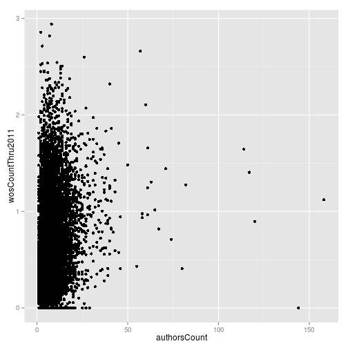

Do papers with more authors get more social media buzz?

~~~{.r}
ggplot(counts_norm, aes(x = authorsCount, y = backtweetsCount)) +
  geom_point()
~~~

~~~{.output}
Warning: Removed 6614 rows containing missing values (geom_point).

~~~

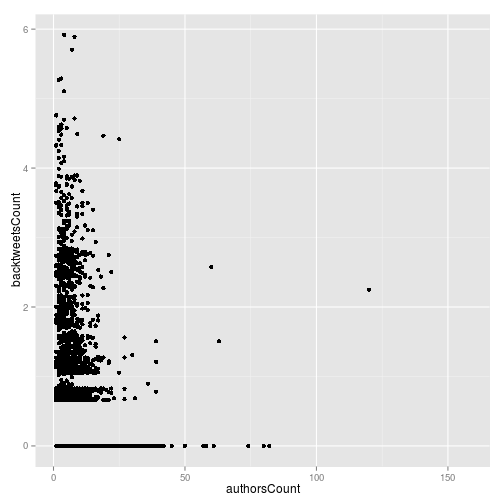

~~~{.r}
ggplot(counts_norm, aes(x = authorsCount, y = facebookLikeCount)) +
  geom_point()
~~~

~~~{.output}
Warning: Removed 11970 rows containing missing values (geom_point).

~~~

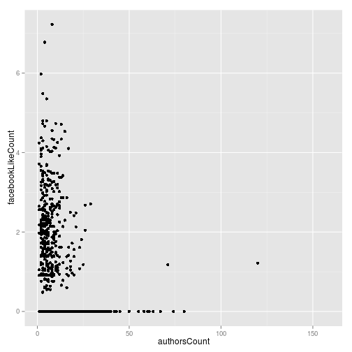

Relationship between Twitter and Facebook.

~~~{.r}
ggplot(counts_norm, aes(x = backtweetsCount, y = facebookLikeCount)) +
  geom_point()
~~~

~~~{.output}
Warning: Removed 13264 rows containing missing values (geom_point).

~~~

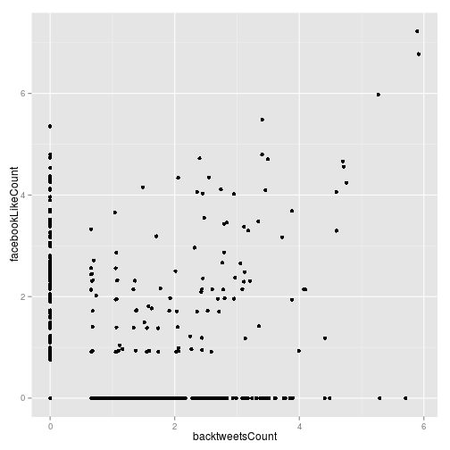

Number of authors by journal.

~~~{.r}
ggplot(counts_norm, aes(x = journal, y = authorsCount)) +
  geom_boxplot()
~~~

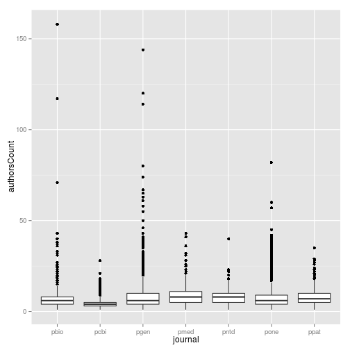

Effect of time on number of citations.

~~~{.r}
ggplot(counts_norm, aes(x = daysSincePublished, y = wosCountThru2011)) +
  geom_point()
~~~

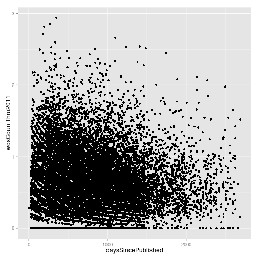

How do the experts do?

~~~{.r}
ggplot(counts_norm, aes(x = f1000Factor, y = wosCountThru2011)) +
  geom_point()
~~~

~~~{.output}
Warning: Removed 2805 rows containing missing values (geom_point).

~~~

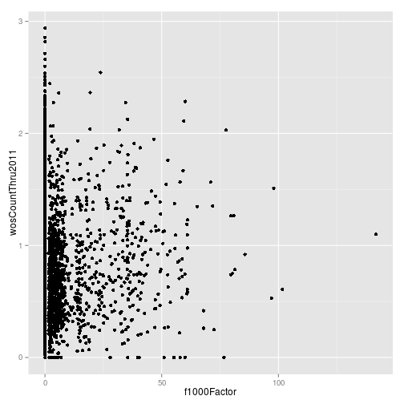

Compared to the masses?

~~~{.r}
ggplot(counts_norm, aes(x = backtweetsCount, y = wosCountThru2011)) +
  geom_point()
~~~

~~~{.output}
Warning: Removed 6614 rows containing missing values (geom_point).

~~~

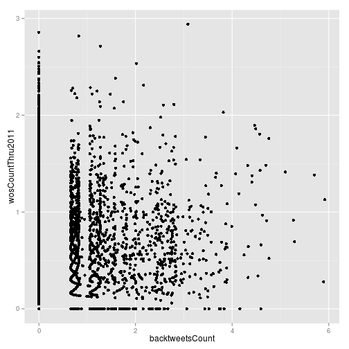

split by journal

~~~{.r}
ggplot(counts_norm, aes(x = backtweetsCount, y = wosCountThru2011)) +
  geom_point() +
  facet_wrap(~journal)
~~~

~~~{.output}
Warning: Removed 1325 rows containing missing values (geom_point).

~~~

~~~{.output}
Warning: Removed 1068 rows containing missing values (geom_point).

~~~

~~~{.output}
Warning: Removed 1299 rows containing missing values (geom_point).

~~~

~~~{.output}
Warning: Removed 643 rows containing missing values (geom_point).

~~~

~~~{.output}
Warning: Removed 621 rows containing missing values (geom_point).

~~~

~~~{.output}
Warning: Removed 199 rows containing missing values (geom_point).

~~~

~~~{.output}
Warning: Removed 1459 rows containing missing values (geom_point).

~~~

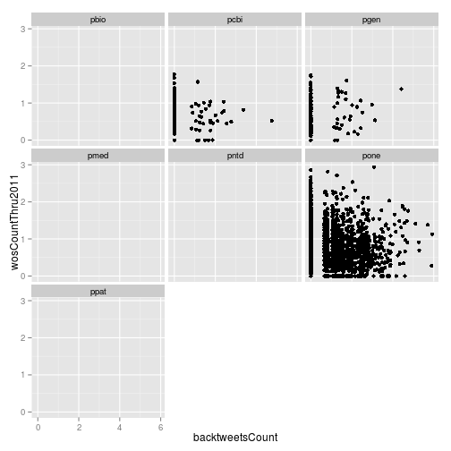

split by year

~~~{.r}
ggplot(counts_norm, aes(x = backtweetsCount, y = wosCountThru2011)) +
  geom_point() +
  facet_wrap(~year)
~~~

~~~{.output}
Warning: Removed 33 rows containing missing values (geom_point).

~~~

~~~{.output}
Warning: Removed 187 rows containing missing values (geom_point).

~~~

~~~{.output}
Warning: Removed 419 rows containing missing values (geom_point).

~~~

~~~{.output}
Warning: Removed 873 rows containing missing values (geom_point).

~~~

~~~{.output}
Warning: Removed 1011 rows containing missing values (geom_point).

~~~

~~~{.output}
Warning: Removed 1287 rows containing missing values (geom_point).

~~~

~~~{.output}
Warning: Removed 1637 rows containing missing values (geom_point).

~~~

~~~{.output}
Warning: Removed 1167 rows containing missing values (geom_point).

~~~

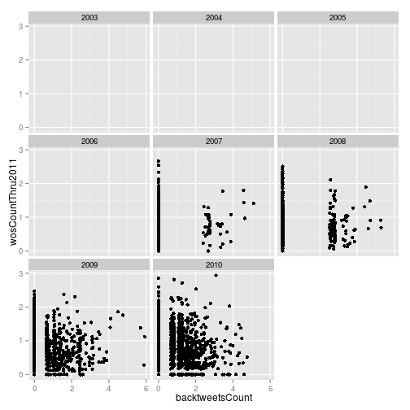

Wikipedia and citation count

~~~{.r}
ggplot(counts_norm, aes(x = wikipediaCites, y = wosCountThru2011)) +
  geom_point()
~~~

~~~{.output}
Warning: Removed 5589 rows containing missing values (geom_point).

~~~

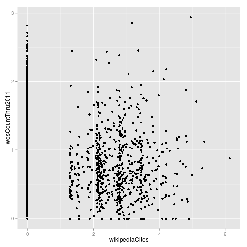

Wikipedia and Facebook

~~~{.r}
ggplot(counts_norm, aes(x = wikipediaCites, y = facebookLikeCount)) +
  geom_point()
~~~

~~~{.output}
Warning: Removed 13804 rows containing missing values (geom_point).

~~~

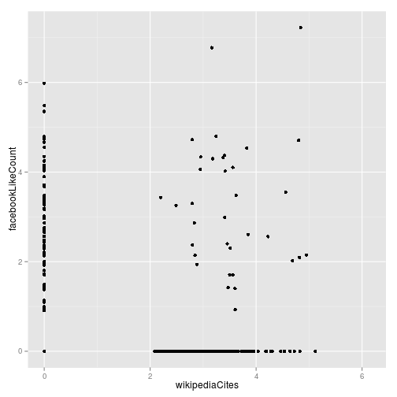

Downloads and citation counts.

~~~{.r}
ggplot(counts_norm, aes(x = pdfDownloadsCount, y = wosCountThru2011)) +
  geom_point()
~~~

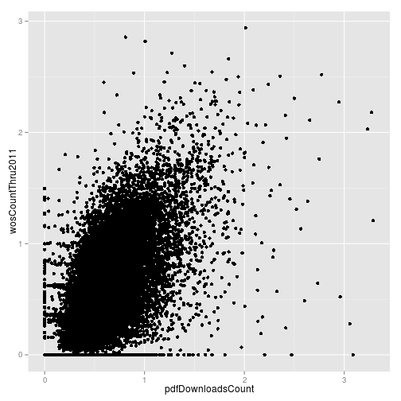

Downloads and mendeleyReadersCount

~~~{.r}
ggplot(counts_norm, aes(x = pdfDownloadsCount, y = mendeleyReadersCount)) +
  geom_point()
~~~

~~~{.output}
Warning: Removed 5 rows containing missing values (geom_point).

~~~

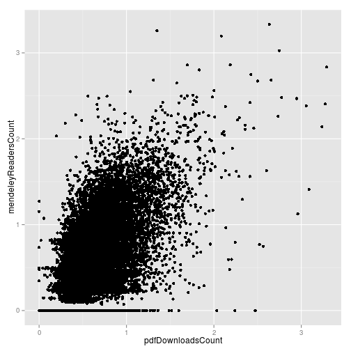

HTML page view versus PDF downloads

~~~{.r}
ggplot(counts_norm, aes(x = htmlDownloadsCount, y = pdfDownloadsCount)) +
  geom_point() +
  facet_wrap(~journal)
~~~

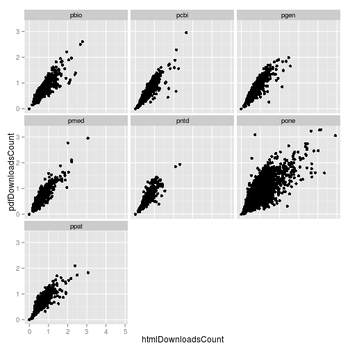

~~~{.r}
counts_norm <- mutate(counts_norm, immuno = grepl("Immunology", plosSubjectTags))
~~~

~~~{.r}
ggplot(counts_norm, aes(x = htmlDownloadsCount, y = pdfDownloadsCount,
                        color = immuno)) +
  geom_point() +
  facet_wrap(~journal)
~~~

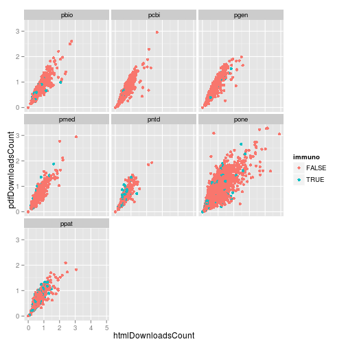

Where are immuno papers published?

~~~{.r}
ggplot(counts_norm, aes(x = journal, fill = immuno)) +
  geom_bar()
~~~

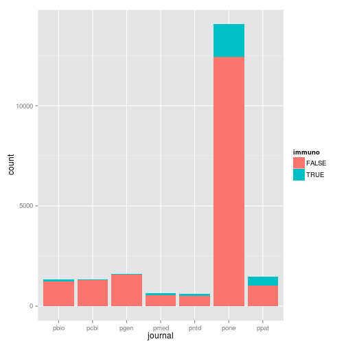

Evolutionary biology papers?

~~~{.r}
counts_norm <- mutate(counts_norm, evo = grepl("Evolutionary Biology", plosSubjectTags))
~~~

~~~{.r}
ggplot(counts_norm, aes(x = journal, fill = evo)) +
  geom_bar()
~~~

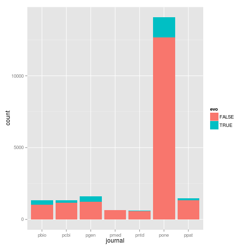
