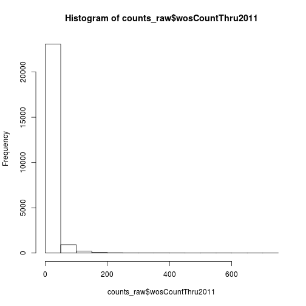
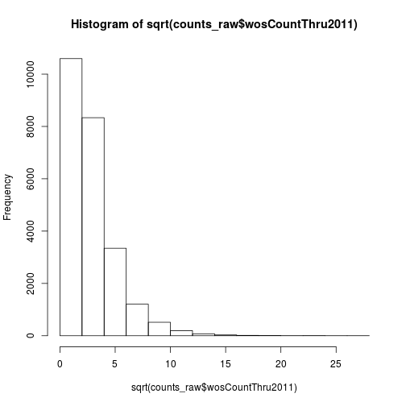
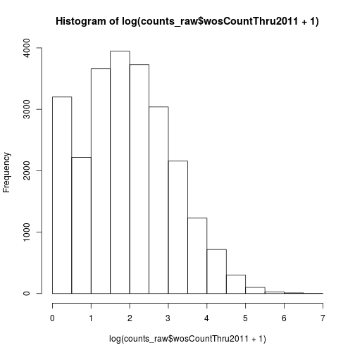
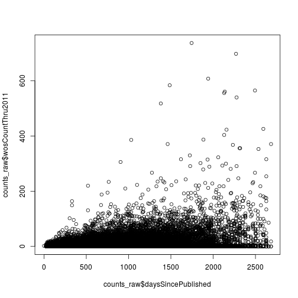

> ## Learning Objectives {.objectives}
>
> * Import tabular data
> * Inspect objects
> * Explain the different types of data in R
> * Explore data with basic summary statistics and visualizations

Using the Unix shell, we were able to obtain quick summaries of the data set.
Importing the data into R will enable us more thoroughly analyze the data.

### Importing data

The most commonly used function for importing tabular data is `read.table`.
In most cases this is what we will want to use.
However, this particular data set includes the titles of research articles, which can prove quite difficult for `read.table` to parse.
For example, if an article title mentions a 3' UTR, `read.table` will interpret that as a quotation mark.
To avoid problems like this, we will use the function `read.delim`.
Basically, it is just `read.table` with the defaults set to handle these more difficult cases.

~~~{.r}
counts_raw <- read.delim("data/counts-raw.txt.gz")
~~~

This reads in the data and stores it as a data frame.
We confirm that it is present in our R environment using the function `ls`, named after the Unix function of similar utility.

~~~{.r}
ls()
~~~

~~~{.output}
[1] "counts_raw" "hook_in"    "hook_out"  

~~~

For a quick inspection, we use `dim`, `head`, and `tail`.
`dim` tells us the dimensions of the data frame, rows then columns.
`head` and `tail` work similarly to their Unix counterparts, with the second argument specifying the number of lines to display.

~~~{.r}
dim(counts_raw)
~~~

~~~{.output}
[1] 24331    32

~~~

~~~{.r}
head(counts_raw, 1)
~~~

~~~{.output}
                           doi    pubDate journal
1 10.1371/journal.pbio.0000001 2003-10-13    pbio
                                                                        title
1 A Functional Analysis of the Spacer of V(D)J Recombination Signal Sequences
       articleType authorsCount f1000Factor backtweetsCount deliciousCount
1 Research Article            6           6               0              0
      pmid                           plosSubjectTags plosSubSubjectTags
1 14551903 Cell Biology|Immunology|Molecular Biology                   
  facebookShareCount facebookLikeCount facebookCommentCount
1                  0                 0                    0
  facebookClickCount mendeleyReadersCount almBlogsCount pdfDownloadsCount
1                  0                    4             0               348
  xmlDownloadsCount htmlDownloadsCount almCiteULikeCount almScopusCount
1                71               6131                 0             28
  almPubMedCentralCount almCrossRefCount plosCommentCount
1                     7                5                0
  plosCommentResponsesCount wikipediaCites year daysSincePublished
1                         0              0 2003               2628
  wosCountThru2010 wosCountThru2011
1               29               33

~~~

~~~{.r}
tail(counts_raw, 1)
~~~

~~~{.output}
                               doi    pubDate journal
24331 10.1371/journal.ppat.1001215 2010-11-24    ppat
                                                                       title
24331 Structural Analysis of HIV-1 Maturation Using Cryo-Electron Tomography
           articleType authorsCount f1000Factor backtweetsCount
24331 Research Article            6           0               0
      deliciousCount pmid     plosSubjectTags
24331              0   NA Biophysics|Virology
                                                                                                                                               plosSubSubjectTags
24331 Macromolecular Assemblies and Machines|Antivirals, including Modes of Action and Resistance|Immunodeficiency Viruses|Virion Structure, Assembly, and Egress
      facebookShareCount facebookLikeCount facebookCommentCount
24331                  0                 0                    0
      facebookClickCount mendeleyReadersCount almBlogsCount
24331                  0                    0             0
      pdfDownloadsCount xmlDownloadsCount htmlDownloadsCount
24331                 0                 0                  0
      almCiteULikeCount almScopusCount almPubMedCentralCount
24331                 0              0                     0
      almCrossRefCount plosCommentCount plosCommentResponsesCount
24331                0                0                         0
      wikipediaCites year daysSincePublished wosCountThru2010
24331              0 2010                 29                0
      wosCountThru2011
24331                6

~~~

We can also check the Environment tab of RStudio to learn similar information.

### Accessing data

Now that the data has been imported into R and stored as a data frame, we need to access the data.
There are numerous ways to do this, but we will focus on just a few main methods.

The first is using numbers to specify the rows and columns.
To do this, we use square brackets (`[]`) separating the row index from the column index with a comma.

~~~{.r}
counts_raw[1, 10]  # value in 1st row of 10th column
~~~

~~~{.output}
[1] 14551903

~~~

Extending this, we can obtain a range of contiguous values using the colon operator.

~~~{.r}
counts_raw[1:3, 10:12] # rows 1 thru 3 of columns 10 thru 12
~~~

~~~{.output}
      pmid
1 14551903
2 14624234
3       NA
                                                                         plosSubjectTags
1                                              Cell Biology|Immunology|Molecular Biology
2                       Biotechnology|Genetics and Genomics|Infectious Diseases|Virology
3 Computational Biology|Biotechnology|Genetics and Genomics|Infectious Diseases|Virology
  plosSubSubjectTags
1                   
2                   
3                   

~~~

Lastly, if we omit either the rows or the columns, it outputs all the rows or columns.

~~~{.r}
counts_raw[1:3, ] # rows 1 thru 3 of every column
~~~

~~~{.output}
                           doi    pubDate journal
1 10.1371/journal.pbio.0000001 2003-10-13    pbio
2 10.1371/journal.pbio.0000002 2003-11-17    pbio
3 10.1371/journal.pbio.0000003 2003-11-17    pbio
                                                                        title
1 A Functional Analysis of the Spacer of V(D)J Recombination Signal Sequences
2                 Viral Discovery and Sequence Recovery Using DNA Microarrays
3                                               Gene Chip for Viral Discovery
       articleType authorsCount f1000Factor backtweetsCount deliciousCount
1 Research Article            6           6               0              0
2 Research Article           14           0               0              0
3         Synopsis           NA           0               0              0
      pmid
1 14551903
2 14624234
3       NA
                                                                         plosSubjectTags
1                                              Cell Biology|Immunology|Molecular Biology
2                       Biotechnology|Genetics and Genomics|Infectious Diseases|Virology
3 Computational Biology|Biotechnology|Genetics and Genomics|Infectious Diseases|Virology
  plosSubSubjectTags facebookShareCount facebookLikeCount
1                                     0                 0
2                                     0                 0
3                                     0                 0
  facebookCommentCount facebookClickCount mendeleyReadersCount
1                    0                  0                    4
2                    0                  0                   17
3                    0                  0                    0
  almBlogsCount pdfDownloadsCount xmlDownloadsCount htmlDownloadsCount
1             0               348                71               6131
2             0              2436                74              14149
3             0               220                48               2952
  almCiteULikeCount almScopusCount almPubMedCentralCount almCrossRefCount
1                 0             28                     7                5
2                 3            141                    54               40
3                 0              1                     0                0
  plosCommentCount plosCommentResponsesCount wikipediaCites year
1                0                         0              0 2003
2                0                         0              0 2003
3                0                         0              0 2003
  daysSincePublished wosCountThru2010 wosCountThru2011
1               2628               29               33
2               2593              137              181
3               2593                0                0

~~~

One downside of this approach is that it can be difficult to remember which column contains which data, especially with 32 columns!

Here are two equivalent to select a column by name and show the first 10 rows:

~~~{.r}
counts_raw[1:10, "pmid"]
~~~

~~~{.output}
 [1] 14551903 14624234       NA       NA 12929205 12929206       NA
 [8] 14551906 14551907 14551908

~~~

~~~{.r}
counts_raw$pmid[1:10]
~~~

~~~{.output}
 [1] 14551903 14624234       NA       NA 12929205 12929206       NA
 [8] 14551906 14551907 14551908

~~~

The first is similar to what we have seen before with the square brackets, but instead of using a number to select the column we type it's name in quotes.
The second uses the dollar sign operator, which converts the column of the data frame to a vector.
Since vectors have only one dimension, we just put one set of indexes inside the square brackets.

### Understanding the different types of data

The base storage object in R is the vector,
and each vector only contains data of the same type.
Here we will quickly review the different types of data stored by R.

Each column of our data frame is a vector containing a particular type of data.
To understand what data is stored in an object, we will use the function `str`, which displays the _str_ucture of an object.
We'll start with the column `daysSincePublished`.

~~~{.r}
str(counts_raw$daysSincePublished)
~~~

~~~{.output}
 int [1:24331] 2628 2593 2593 2628 2684 2684 2684 2628 2628 2628 ...

~~~

The output shows us three things.
First it tells us the data type is `int` for integer.
Second it tells us the dimensions of the object.
And third it shows the first few values stored in the object.

The data type changes if the values are non-integers, so if we had a column with the number of weeks since published:

~~~{.r}
str(counts_raw$daysSincePublished / 7)
~~~

~~~{.output}
 num [1:24331] 375 370 370 375 383 ...

~~~

The data type would be `num` for numeric.
In many computer programming languages, you have to be very careful about this distinction because integers and non-integers are treated very differently.
However, this is not the case in R.
As proof, both the days and the weeks are considered to be numeric.

~~~{.r}
is.numeric(counts_raw$daysSincePublished)
~~~

~~~{.output}
[1] TRUE

~~~

~~~{.r}
is.numeric(counts_raw$daysSincePublished / 7)
~~~

~~~{.output}
[1] TRUE

~~~

All of the data types have similar functions, `is.x`, to check if an object is of a certain data type, and `as.x`, which converts the object to that data type.
We will see later in the lessons on Defensive Programming that these are very useful for validating our code.

> ## If you need integers {.callout}
>
> If you ever find a situation where you must have integers and not numeric values, you can explcitly specify this by adding an upper case L after the number, e.g. `1L`, `2L`, etc.

Next let's check the column `journal`, which contains the PLOS journal the article was published in:

~~~{.r}
str(counts_raw$journal)
~~~

~~~{.output}
 Factor w/ 7 levels "pbio","pcbi",..: 1 1 1 1 1 1 1 1 1 1 ...

~~~

It is stored as a factor.
Factor are useful for storing categorical variables, albeit quite complicated.
Factor objects are actually composed of two separate data types.
All the possible values a factor can take are stored as a character vector and are referred to as the "levels" of the factor.
A character vector contains non-numeric values, which are always shown in quotation marks to distinguish them from the names of objects in the R environment.
We can access these with the function `levels`.

~~~{.r}
levels(counts_raw$journal)
~~~

~~~{.output}
[1] "pbio" "pcbi" "pgen" "pmed" "pntd" "pone" "ppat"

~~~

~~~{.r}
is.character(levels(counts_raw$journal))
~~~

~~~{.output}
[1] TRUE

~~~

From the `str` output, we saw that `journal` is a factor with 7 levels.
It listed 2 of the 7 levels, and then after the colon listed the values at the beginning of the vector.
Strangely, these were integers!
These integers refer to which of the levels that value should take.
However, when we run something like `head`, R replaces the integers with its corresponding value in the "levels" character vector.

~~~{.r}
head(counts_raw$journal)
~~~

~~~{.output}
[1] pbio pbio pbio pbio pbio pbio
Levels: pbio pcbi pgen pmed pntd pone ppat

~~~

Thus we need to be careful with factors, because they often appear as if they are character vectors but will sometimes behave like numeric vectors because R is storing them as integers.

> ## stringsAsFactors = FALSE {.callout}
>
> By default R converts character vectors into factors in imported data sets.
> While this can be convenient for columns with categorical varialbes, e.g. `journal`, it is cumbersome for columns where every value is unique, e.g. `title`.
> Because of this, we recommend setting the options `stringsAsFactors = FALSE` whenever using `read.table`, `read.delim`, or a similar function.
> We keep the default here because we wish to demonstrate some of the potential problems with factors.

Importantly, R is also able to handle missing values.
Missing values are represented by the special constant `NA`,
and can be included in a vector of any data type.
We can detect the presence of an `NA` using the functions `is.na` and `anyNA` which report the status of each element of a vector or the entire vector, respectively.

~~~{.r}
counts_raw$authorsCount[1:10]
~~~

~~~{.output}
 [1]  6 14 NA NA  6 10 NA NA NA  5

~~~

~~~{.r}
is.na(counts_raw$authorsCount[1:10])
~~~

~~~{.output}
 [1] FALSE FALSE  TRUE  TRUE FALSE FALSE  TRUE  TRUE  TRUE FALSE

~~~

~~~{.r}
anyNA(counts_raw$authorsCount[1:10])
~~~

~~~{.output}
[1] TRUE

~~~

The output of these functions is the last data type, a logical vector.
We will see how useful these are in the lesson on conditional statements.

### Explore data

R has many convenient functions for exploring and understanding data.
Here we'll review a few by investigating the column `wosCountThru2011`, which contains the number of citations as of 2011.

One quick way is to use the function `summary`.

~~~{.r}
summary(counts_raw$wosCountThru2011)
~~~

~~~{.output}
   Min. 1st Qu.  Median    Mean 3rd Qu.    Max. 
   0.00    2.00    6.00   13.51   15.00  737.00 

~~~

The result is a vector with many useful summary statistics.
Also notice that the vector has names for each of the elements.
We didn't cover this above, but just like we can type the name of column when accessing a data frame, we can do the same thing with a vector if its elements have names.

~~~{.r}
summary(counts_raw$wosCountThru2011)["Mean"]
~~~

~~~{.output}
 Mean 
13.51 

~~~

And of course R also has individual functions that perform these operations and more.

~~~{.r}
mean(counts_raw$wosCountThru2011)
~~~

~~~{.output}
[1] 13.51087

~~~

~~~{.r}
median(counts_raw$wosCountThru2011)
~~~

~~~{.output}
[1] 6

~~~

~~~{.r}
sd(counts_raw$wosCountThru2011)
~~~

~~~{.output}
[1] 26.59553

~~~

We can also visualize the distribution of the data with the plotting function `hist`.

~~~{.r}
hist(counts_raw$wosCountThru2011)
~~~

The data has a very long right tail.
Let's try some different transformations to better visualize the distribution.
We can compute the square root of the citations with `sqrt`.

~~~{.r}
hist(sqrt(counts_raw$wosCountThru2011))
~~~

Another option is log transformation.

~~~{.r}
hist(log(counts_raw$wosCountThru2011 + 1))
~~~

We added a pseudocount of 1 to avoid taking the log of zero.
Recall that in R vectors are "recycled".
In other words, the number 1 is a vector of length one, but it gets "recycled" such that 1 gets added to every element of `wosCountThru2011`.

Lastly, the function `plot` creates a scatter plot.

~~~{.r}
plot(counts_raw$daysSincePublished, counts_raw$wosCountThru2011)
~~~

Now that we can import and explore data, we'll next start filtering the data using conditional statements.

> ## Citations versus weeks since publication {.challenge}
> Create a scatter plot where the x-axis is the number of weeks since publication and the 
y-axis is the log of the 2011 citations (use `wosCountThru2011`).
> Don't forget to add a pseudocount of 1.

