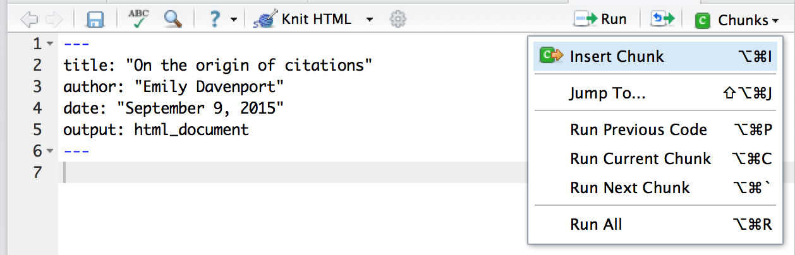

> ## Learning Objectives {.objectives}
> Learn how to specify tables of contents and output styles for writing R Markdown reports. 

Let's start assembling our altmetrics code into a R Markdown file so we can generate a report of some of our analyses. 
First, let's create a new R Markdown document with the title "On the origin of citations".
Once you create the R Marktown document, delete all of the demo contents below the header information. 


Let's start by loading our data. 
First, using a single hashtag header level, let's indicate we're going to load data in Markdown.
Next, let's create a new chunk that loads the data. 
To do so, either you can enter three backticks in a row, followed by {r}, or you can click on the green `Chunks` button and chose `Insert Chunk`:



In this chunk, let's load our data.
Additionally, let's name the chunk `data_load`.

<pre><code>```{r data_load}
counts_raw <- read.delim("data/counts-raw.txt.gz")
counts_norm <- read.delim("data/counts-norm.txt.gz")
```</code></pre>

Next, let's add a section on exploring the data.
Use another single hastag header to write "Exploring the data".
Insert another chunk that plots a histogram of the number of authors per paper. 

<pre><code>```{r author_histogram}
hist(counts_raw$authorsCount, main="Authors per paper", xlab="# authors")
```</code></pre>

This is a good start to an R Markdown file for our analyses, but there are some additional features we can use when outputting the rendered HTML. 

First, you can add a table of contents that with automatically reference your headers.
To do so, you need to edit the header so that under the `html_document:` line it says `toc: true`:

```
---
title: "On the origin of citations"
author: "H. Potter"
date: "December 31, 1999"
output:
  html_document:
    toc: true
---
```

Knit the document and notice you now have links to the top for each of your sections. 
Additionally, you can number the sections by adding `number_sections` under the `html_document` line in the header:

```
---
title: "On the origin of citations"
author: "H. Potter"
date: "December 31, 1999"
output:
  html_document:
    toc: true
    number_sections: true
---
```

Note that if you have smaller headers within each section (two hashtags), the numbering will be heirarchical.


In addition to creating a table of content, so you can also change the style of your document. 
Themes are a way of updating colors and fonts which relies on the library from <http://bootswatch.com/>.
Click on the link and search for a theme that you like.
The themes included with RStudio are “default”, “cerulean”, “journal”, “flatly”, “readable”, “spacelab”, “united”, “cosmo”.
To change the theme of your document, update the header under the html_document: line to include `theme`:

```
---
title: "On the origin of citations"
author: "H. Potter"
date: "December 31, 1999"
output:
  html_document:
    toc: true
    number_sections: true
    theme: cerulean
---
```

R Markdown rendering is designed to make your code more readable.
One of the things incorporated is syntax highlighting. 
You can change the style of the syntax highlighting using the `highlight` argument in the header. 
Your options to choose from are "default", "tango", "pygments", "kate", "monochrome", "espresso", "zenburn", "haddock", and "textmate".
Try some different options and pick which one you like most. 

```
---
title: "On the origin of citations"
author: "H. Potter"
date: "December 31, 1999"
output:
  html_document:
    toc: true
    number_sections: true
    theme: cerulean
    highlight: espresso
---
```


In addition to the style of the text of your report, you can also control the style of the figures in your report. 
You can set `fig_width` and `fig_height` in the header to set what size you want your images to appear.
The default figure size is 7 inches wide by 5 inches tall.
Let's try making ours wider and shorter by setting the width to be 10 inches and the height to be 3 inches:

```
---
title: "On the origin of citations"
author: "H. Potter"
date: "December 31, 1999"
output:
  html_document:
    toc: true
    number_sections: true
    theme: cerulean
    highlight: espresso
    fig_width: 10
    fig_height: 3
---
```

To create professional looking reports, you can also generate figure captions.
To add a figure caption to a figure, you must specifiy in the brackets at the beginning of the chunk what you want the caption to say using the argument `fig.cap`. 
Let's add a caption to our histogram by editing the `author_histogram` chunk:

<pre><code>```{r author_histogram, fig.caption="Figure 1: Number of Authors per Article"}
hist(counts_raw$authorsCount, main="Authors per paper", xlab="# authors")
```</code></pre>

Additionally, in the header you must specify `fig_caption: yes` under the `html_document` line.

```
---
title: "On the origin of citations"
author: "H. Potter"
date: "December 31, 1999"
output:
  html_document:
    toc: true
    number_sections: true
    theme: cerulean
    highlight: espresso
    fig_width: 10
    fig_height: 3
    fig_caption: yes
---
```


While it's nice to have all of your code and results in one place, sometimes you'll also want your figures printed to a separate file so that you can include them in manuscripts, presentations, or posters. 
You can specify the `self_contained` option as false in the header, which will generate all the files used to render the HTML. 

```
---
title: "On the origin of citations"
author: "H. Potter"
date: "December 31, 1999"
output:
  html_document:
    toc: true
    number_sections: true
    theme: cerulean
    highlight: espresso
    fig_width: 10
    fig_height: 3
    fig_caption: yes
    self_contained: false
---
```

Knit the document and then look in the altmetrics directory. 
You can see there is a folder called `altmetrics_analyses_files`.
In that folder is another directory called `figure-html`.
In that folder you will see a file called `author_histogram-1.png`, which is the name of the chunk that held the code to create the histogram followed by `-1`. 
Although low resolution, this image could be emailed to collaborators or put in a presentation. 

> ## Update analysis file {.challenge}
>
> You need to share your initial results with your collaborators, but after showing your report to your boss, they had a few suggestions.
>
> 1. In your final report, your collaborators should see your histogram of authors per paper, but not the code that produced the plot.  
> 2. The figure is hard to see as is, resize it to 8x8 inches
> 3. Your collaborators are very interested in how popular articles are on Facebook. Add another histogram plotting the number of facebook shares per article, ensuring there are respectible titles and axis labels. Also, just like the previous figure, make sure there is a legend and that the code to generate the figure does not appear in the final report. 
> 4. Additionally under the new figure, your collaborators should see a sentence that says "The average number of Facebook shares per paper in the data set is X", where X is the mean number of Facebook shares per paper, as evaluated by inline code. 
