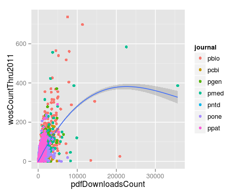
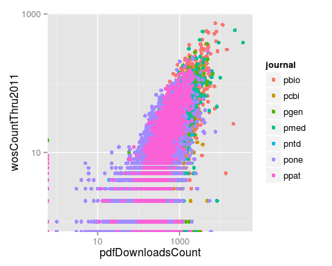
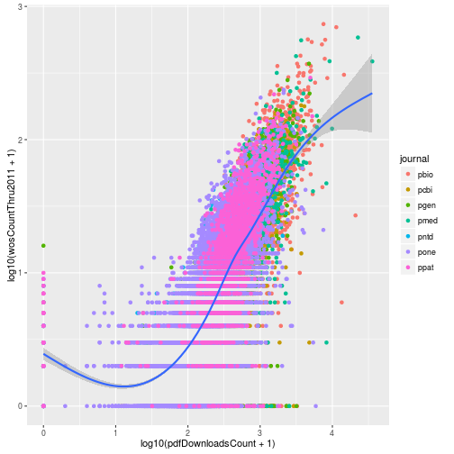
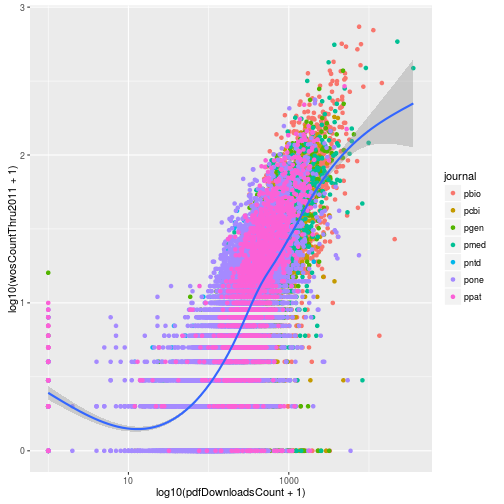
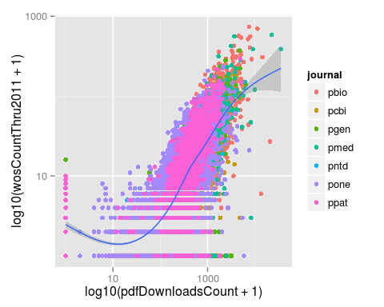
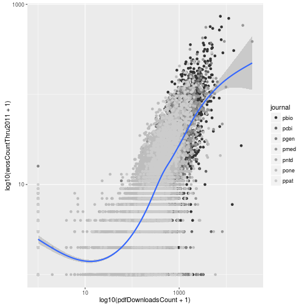
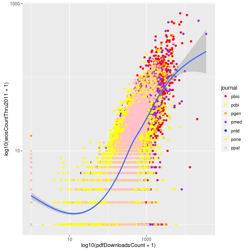
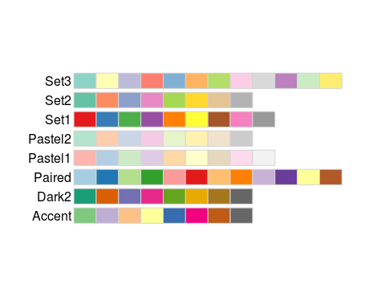
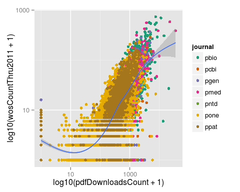
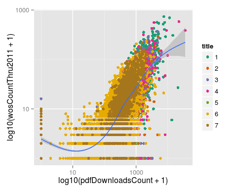

> ## Learning Objectives {.objectives}
>
> * Scales affect how data is mapped to aesthetics
> * Use variants of `scale_x_*` and `scale_y_*` to control axes
> * Use variants of `scale_color_*` to control color scheme

In the last lesson we made our first plots with ggplot2 by mapping columns of a data frame to the plot aesthetics.
We can modify the transformation of the data to the plot using scales.
These allow us to customize the display of the data.

### Scales that affect mapping to x and y

In the last lesson we plotted the number of PDF downloads versus the 2011 citation count.

~~~{.r}
p <- ggplot(research, aes(x = pdfDownloadsCount, y = wosCountThru2011)) +
  geom_point(aes(color = journal)) +
  geom_smooth()
p
~~~

~~~{.output}
geom_smooth: method="auto" and size of largest group is >=1000, so using gam with formula: y ~ s(x, bs = "cs"). Use 'method = x' to change the smoothing method.

~~~

This was not a very effective visualization because the majority of the points were clustered in the bottom left part of the graph.
To improve it, we can log transform the axes.
We do this by adding the ggplot2 functions `scale_x_log10` and `scale_y_log10`.

~~~{.r}
p + scale_x_log10() + scale_y_log10()
~~~

~~~{.output}
geom_smooth: method="auto" and size of largest group is >=1000, so using gam with formula: y ~ s(x, bs = "cs"). Use 'method = x' to change the smoothing method.

~~~

However because of all the zeros in the data, the loess curve failed to work.
Instead of log transforming using the scales, instead we can directly log transform the columns when specifying the aesthetic mappings.
This allows us to add the pseudocount to avoid taking the log of zero.

~~~{.r}
p <- ggplot(research, aes(x = log10(pdfDownloadsCount + 1), y = log10(wosCountThru2011 + 1))) +
  geom_point(aes(color = journal)) +
  geom_smooth()
p
~~~

~~~{.output}
geom_smooth: method="auto" and size of largest group is >=1000, so using gam with formula: y ~ s(x, bs = "cs"). Use 'method = x' to change the smoothing method.

~~~

This gives us the same result plus the loess curve.
One big difference between the two approaches is the labeling of the axes.
When we log transformed using the scale functions, the axis labels were automatically updated to reflect the transformation.
We can manually update the axis labels using `scale_x_continuous`.
To mimic the axes of the earlier plot, we create breaks 1 and 3 which correspond to data values of 10 (10^1^) and 1000 (10^3^).

~~~{.r}
p <- ggplot(research, aes(x = log10(pdfDownloadsCount + 1), y = log10(wosCountThru2011 + 1))) +
  geom_point(aes(color = journal)) +
  geom_smooth() +
  scale_x_continuous(breaks = c(1, 3), labels = c(10, 1000))
p
~~~

~~~{.output}
geom_smooth: method="auto" and size of largest group is >=1000, so using gam with formula: y ~ s(x, bs = "cs"). Use 'method = x' to change the smoothing method.

~~~

And then we can do the same for the y-axis.

~~~{.r}
p <- ggplot(research, aes(x = log10(pdfDownloadsCount + 1), y = log10(wosCountThru2011 + 1))) +
  geom_point(aes(color = journal)) +
  geom_smooth() +
  scale_x_continuous(breaks = c(1, 3), labels = c(10, 1000)) +
  scale_y_continuous(breaks = c(1, 3), labels = c(10, 1000))
p
~~~

~~~{.output}
geom_smooth: method="auto" and size of largest group is >=1000, so using gam with formula: y ~ s(x, bs = "cs"). Use 'method = x' to change the smoothing method.

~~~

### Scales that affect mapping to color

When we mapped the column `journal` to the color of the points, ggplot2 assigned its default colors.
Using scale functions, we can control the colors used in the plot.
These all have the form `scale_color_*`.
For example, we could use grayscale.

~~~{.r}
p + scale_color_grey()
~~~

~~~{.output}
geom_smooth: method="auto" and size of largest group is >=1000, so using gam with formula: y ~ s(x, bs = "cs"). Use 'method = x' to change the smoothing method.

~~~

Or we could manually specify each of the colors for the seven journals.
The colors are assigned to the factor levels in the order they are listed in the output from `levels`.

~~~{.r}
levels(research$journal)
~~~

~~~{.output}
[1] "pbio" "pcbi" "pgen" "pmed" "pntd" "pone" "ppat"

~~~

~~~{.r}
p + scale_color_manual(values = c("red", "yellow", "orange", "purple", "blue", "yellow", "pink"))
~~~

~~~{.output}
geom_smooth: method="auto" and size of largest group is >=1000, so using gam with formula: y ~ s(x, bs = "cs"). Use 'method = x' to change the smoothing method.

~~~

But as that example demonstrates, choosing good colors to aid visualization requires some thought.
Luckily others have already created nice color palettes for visualization.
ggplot2 provides easy access to the ColorBrewer color palettes developed by Cynthia A. Brewer and colleagues at Pennsylvania State University.
Go to [http://colorbrewer2.org](http://colorbrewer2.org) to view them.
Alternatively you can view them directly in R if you install the package [RColorBrewer](https://cran.r-project.org/web/packages/RColorBrewer/index.html).

~~~{.r}
library("RColorBrewer")
display.brewer.all(type = "qual")
~~~

These are the options available for color coding qualitative differences.
Let's try the palette "Dark2".

~~~{.r}
p + scale_color_brewer(palette = "Dark2")
~~~

~~~{.output}
geom_smooth: method="auto" and size of largest group is >=1000, so using gam with formula: y ~ s(x, bs = "cs"). Use 'method = x' to change the smoothing method.

~~~

Lastly, if we want the descriptions in the legend to be different than the shorthand we use for the raw data, we can do this via any of the `scale_color_*` functions using the argument `labels`.
Here we'll just change them to the numbers 1 through 7 to illustrate the point.

~~~{.r}
p + scale_color_brewer(palette = "Dark2", labels = 1:7)
~~~

~~~{.output}
geom_smooth: method="auto" and size of largest group is >=1000, so using gam with formula: y ~ s(x, bs = "cs"). Use 'method = x' to change the smoothing method.

~~~

### Challenge

> ## Modifying the scales {.challenge}
>
> Update the plot to use a square root transformation instead of log10.
> Also color the points using the ColorBrewer palette "Accent".

