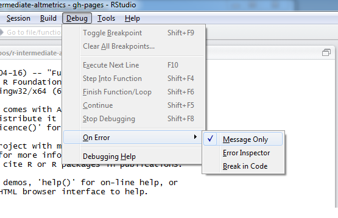

```{r, include = FALSE}
source("tools/chunk-options.R")
```

> ## Learning Objectives {.objectives}
>
> *  Use `print` statements to debug a function
> *  Use `debug` to interactively enter a function environment for debugging
> *  Use `n` to step through a function and `Q` to quit debugging

As we've seen, reducing code repetition is generally a good thing.
It reduces the chance of introducing errors while copy-pasting,
and it makes it easier to understand and/or update code when a routine is written only once.
However, the downside is that it can be harder to determine what the code is doing when an error occurs when the code is contained inside a function.
Since the function environment is separated from the global environment, we cannot observe the values of the variables inside the function after it has failed.
Fortunately, R has multiple tools for debugging functions.

Before starting this lesson, you'll need to change some RStudio settings.
RStudio has made R's debugging tools easier to use by automatically invoking them when an error occurs.
In order to understand what RStudio is doing behind the scenes, we need to deactivate this behavior.
In the menu, go to "Debug".
From the dropdown menu, go to "On Error" and choose the setting "Message Only".



```{r echo = FALSE}
counts_raw <- read.delim("data/counts-raw.txt.gz")
```

Recall the function we wrote earlier to calculate the mean of a metric for each level of a factor.

```{r}
mean_metric_per_var <- function(metric, variable) {
  result <- numeric(length = length(levels(variable)))
  names(result) <- levels(variable)
  for (v in levels(variable)) {
    result[v] <- mean(metric[variable == v])
  }
  return(result)
}
```

And recall we invoke it as follows.

```{r}
mean_metric_per_var(counts_raw$backtweetsCount, counts_raw$journal)
```

However, what can we do if we obtain an unexpected result?
For example, let's calculate the mean the number of tweets per year.

```{r}
mean_metric_per_var(counts_raw$backtweetsCount, counts_raw$year)
```

Strange.
But how do we figure out what exactly is happening?
Recall that the variables defined inside the function are not available outside in the global environment.

```{r}
result
```

One option is to add `print` statements to the function to inform us the values of the variables in inside the function.

```{r}
mean_metric_per_var <- function(metric, variable) {
  result <- numeric(length = length(levels(variable)))
  names(result) <- levels(variable)
  print(result)
  for (v in levels(variable)) {
    result[v] <- mean(metric[variable == v])
    print(result)
  }
  return(result)
}
```

And then re-run the function.

```{r}
mean_metric_per_var(counts_raw$backtweetsCount, counts_raw$year)
```

While this strategy can often be effective, in this case it was not very informative.
Also, we had to edit our function and all we got was a glimpse at what was happening while the function was running.
Let's remove the `print` statements, and re-define the function before trying a new strategy.

```{r}
mean_metric_per_var <- function(metric, variable) {
  result <- numeric(length = length(levels(variable)))
  names(result) <- levels(variable)
  for (v in levels(variable)) {
    result[v] <- mean(metric[variable == v])
  }
  return(result)
}
```

We'll use the R function `debug`.
As an argument, we pass the function that we wish to debug.

```{r}
debug(mean_metric_per_var)
```

Now everytime we run the function `mean_metric_per_var`, we will be entered into R's interactive debugging environment.

```{r eval=FALSE}
mean_metric_per_var(counts_raw$backtweetsCount, counts_raw$year)
```
~~~ {.output}
debugging in: mean_metric_per_var(counts_raw$backtweetsCount, counts_raw$year)
debug at #1: {
    result <- numeric(length = length(levels(variable)))
    names(result) <- levels(variable)
    for (v in levels(variable)) {
        result[v] <- mean(metric[variable == v])
    }
    return(result)
}
~~~
~~~ {.r}
Browse[2]> 
~~~

In the console, we are now in the debugging environment.
Furthermore, RStudio opens the "Source Viewer", which conveniently shows us where in the function we are.
Inside the function, we can run R commands to investigate what is happening, which is much more flexible than having to write multiple `print` statements.
For example, let's list the defined variables.

~~~ {.r}
Browse[2]> ls()
~~~
~~~ {.output}
[1] "metric"   "variable"
~~~

Since we are at the beginning of the function, the only variables defined are the two arguments that were passed to the function.
To continue with the debugging, we need to learn the debugging commands,
which we can see by running `help`.

~~~ {.r}
Browse[2]> help
~~~
~~~ {.output}
n          next
s          step into
f          finish
c or cont  continue
Q          quit
where      show stack
help       show help
<expr>     evaluate expression
~~~

The most useful command is `n` for "next" because we can use it to step through the function line by line.

~~~ {.r}
Browse[2]> n
~~~
~~~ {.output}
debug at #2: result <- numeric(length = length(levels(variable)))
~~~

The output tells us that the next line of code to be executed is #2.
Typing `n` again will execute line #2 and similarly provide a preview of line #3.

~~~ {.r}
Browse[2]> n
~~~
~~~ {.output}
debug at #3: names(result) <- levels(variable)
~~~

Now that `result` has been defined.
Let's inspect it.

~~~ {.r}
Browse[2]> result
~~~
~~~ {.output}
numeric(0)
~~~

As we learned from our earlier `print` statement, `result` is a numeric vector of length 0.
We expect its length to be the number of levels of `variable`.

~~~ {.r}
Browse[2]> levels(variable)
~~~
~~~ {.output}
NULL
~~~

The levels for `variable` are not defined.
Let's run `str` on `variable` to learn how R is storing it.

~~~ {.r}
Browse[2]> str(variable)
~~~
~~~ {.output}
int [1:24331] 2003 2003 2003 2003 2003 2003 2003 2003 2003 2003 ...
~~~

Now we have found the problem!
Levels are only defined for a factor variable, but `year` was stored as an integer (or numeric) vector.
When R imported the data, it saw only numbers in this column, and therefore did not anticipate our use of this column as a factor.

Now that we have identified the problem, we want to exit the debugger.
One option would be to use `f` for "finish", which will run the rest of the function and then exit.
But since we know it won't work anyways, let's use `Q` for "quit".

~~~ {.r}
Browse[2]> Q
~~~

Now we'll update the function so that if `variable` is not a factor, the function will convert it.
To do this we use a conditional statement to check if `variable` is a factor with `is.factor`, and then if needed convert it with `as.factor`.

```{r}
mean_metric_per_var <- function(metric, variable) {
  if (!is.factor(variable)) {
    variable <- as.factor(variable)
  }
  result <- numeric(length = length(levels(variable)))
  names(result) <- levels(variable)
  for (v in levels(variable)) {
    result[v] <- mean(metric[variable == v])
  }
  return(result)
}
```

Since we have re-defined the function, we will no longer be entered into the debugger when we run the function.

```{r}
mean_metric_per_var(counts_raw$backtweetsCount, counts_raw$year)
```

> ## Stopping debugging {.callout}
>
> If we hadn't re-defined the function, but still wanted to stop the debugger from starting everytime the function was called, we could have run `undebug(mean_metric_per_year)`.

And now the function works as expected.

> ## Limit to a subset of levels {.challenge}
>
> What if we were only interested in the mean of the number of tweets in the journals PLOS Biology (pbio) and PLOS One (pone)?
> We could subset to only pass values for these journals to the function `mean_metric_per_var`.
> 
> ```{r}
> mean_metric_per_var(counts_raw$backtweetsCount[counts_raw$journal %in% c("pbio", "pone")],
>                    counts_raw$journal[counts_raw$journal %in% c("pbio", "pone")])
> ```
>
> Unfortunately this still gives us results for the other journals.
> And their result is `NaN`, a special value indiciating "Not a Number".
>
> Use `debug` to isolate and diagnose the problem.
> 
> As an added challenge, can you fix the bug?

```{r include=FALSE}
# Use droplevels
mean_metric_per_var <- function(metric, variable) {
  if (!is.factor(variable)) {
    variable <- as.factor(variable)
  }
  variable <- droplevels(variable)
  result <- numeric(length = length(levels(variable)))
  names(result) <- levels(variable)
  for (v in levels(variable)) {
    result[v] <- mean(metric[variable == v])
  }
  return(result)
}
mean_metric_per_var(counts_raw$backtweetsCount[counts_raw$journal %in% c("pbio", "pone")],
                   counts_raw$journal[counts_raw$journal %in% c("pbio", "pone")])
```
