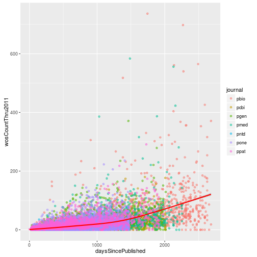
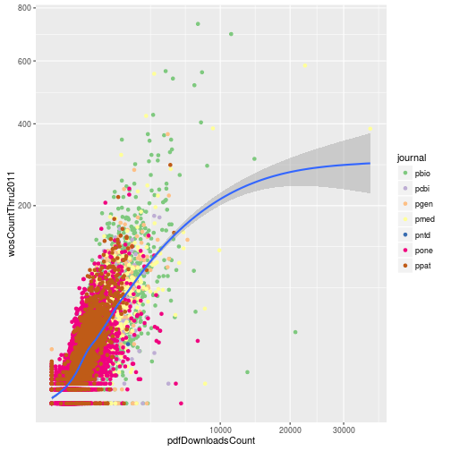
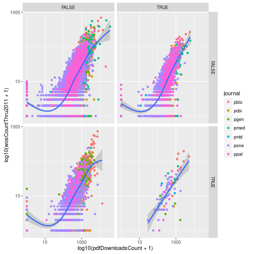
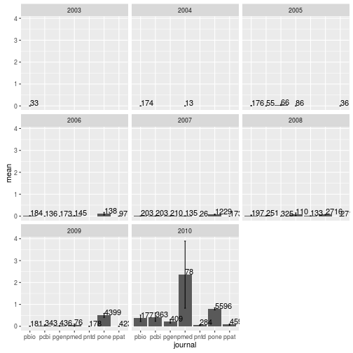
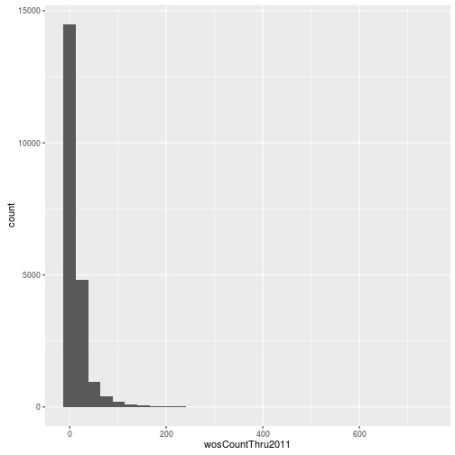
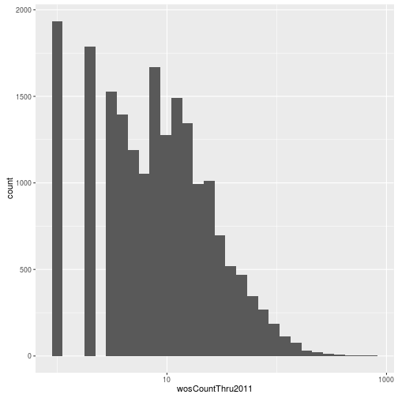
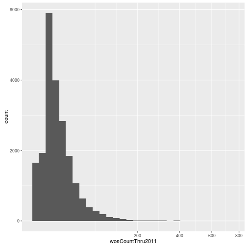
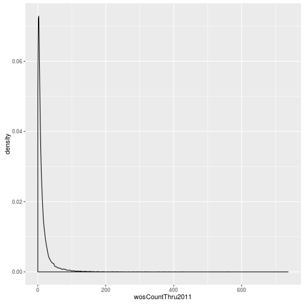
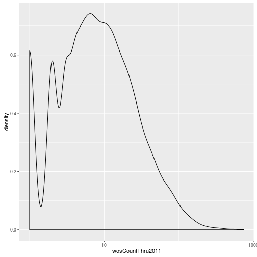
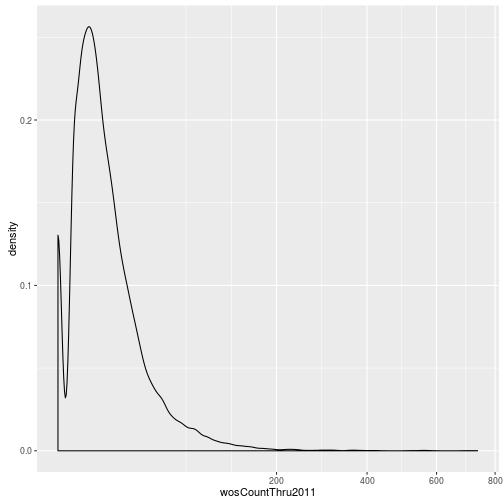

~~~{.r}
library("dplyr")
library("ggplot2")
~~~

This page contains the solutions to the exercises.
Since most of the exercises use `counts-raw.txt.gz`, it is loaded here at the beginning.
Also, many use `research`, the subset of the data that only includes research articles.

~~~{.r}
counts_raw <- read.delim("data/counts-raw.txt.gz")
research <- filter(counts_raw, articleType == "Research Article")
~~~

## 01 Setting up a project

> ## Create a README file {.challenge}
>
> It is a convention to have a file named `README` in a project directory to explain what it contains (both for others and your future self).
> Use `nano` to create a README file.
> Include the date and explain that this directory was created for a Software Carpentry workshop.

Looking for an answer something like the following:

~~~{.bash}
nano README
cat REAMDME
~~~
~~~ {.output}
This directory contains the files created during the Software Carpentry workshop
at X University on YYYY-MM-DD.
~~~

## 02 Inspecting a file

Q: What could be the reason for the discrepancy in the number of articles in our saved file?

A: The first command searches only in column 11. The second looks for matches in any of the columns. Thus the second command returns more lines because these strings are also present in some other columns.

> ## Largest number of Wikipedia cites {.challenge}
>
> What is the largest number of Wikipedia cites that an article in this data set has received?
> Hint: The counts of Wikipedia cites are in column 28.

~~~ {.bash}
gunzip -c counts-raw.txt.gz | cut -f28 | sort -n | tail -n 1
~~~
~~~ {.output}
17
~~~

Alternatively:

~~~ {.bash}
gunzip -c counts-raw.txt.gz | cut -f28 | sort -nr | head -n 1
~~~
~~~ {.output}
17
~~~

> ## Find articles in your field {.challenge}
>
> Choose two PLOS subject tags to search for and save these articles to a new file.
> How many articles are there?

There are lots of possible subject tags to choose from:

~~~ {.bash}
gunzip -c counts-raw.txt.gz | cut -f11 | sort | uniq | wc -l
~~~
~~~ {.output}
6717
~~~

As an example:

~~~ {.bash}
gunzip -c counts-raw.txt.gz | cut -f11 | grep "Cardiovascular Disorders" | grep "Nephrology" | wc -l
~~~
~~~ {.output}
14
~~~

## 03 Using RStudio

> ## Opening and closing RStudio projects {.challenge}
>
> Using the same drop down menu at the top right of RStudio, which you used to create the project, choose to "Close Project".
> In the Console run `getwd`.
> It should display your home folder.
> Furthermore, your home folder should be displayed in the Files pane.
> Now open the altmetrics project using the same menu and run `getwd` again.
> The working directory should have changed to the`altmetrics` directory,
> and the Files pane should display its contents.

If the RStudio Project was setup correctly, this should be straightforward.

## 04 Importing and inspecting data

> ## Citations versus weeks since publication {.challenge}
> Create a scatter plot where the x-axis is the number of weeks since publication and the 
y-axis is the log of the 2011 citations (use `wosCountThru2011`).
> Don't forget to add a pseudocount of 1.

~~~{.r}
plot(counts_raw$daysSincePublished / 7,
     log(counts_raw$wosCountThru2011 + 1))
~~~

## 05 Conditional statments

> ## Filtering articles {.challenge}
>
> How many articles with the subject tag (`plosSubjectTags`) "Evolutionary Biology" were published in either PLOS One ("pone"), PLOS Biology ("pbio"), or PLOS Medicine ("pmed")?

~~~{.r}
dim(counts_raw[grepl("Evolutionary Biology", counts_raw$plosSubjectTags) &
                 counts_raw$journal %in% c("pone", "pbio", "pmed"), ])
~~~

~~~{.output}
[1] 2080   32

~~~

## 06 Loops

> ## Using apply {.challenge}
>
> Using `apply` and `sd`, calculate the standard deviation of each row of `counts_sub`.  
> Using `apply` and `max`, calculate the maximum of each column of `counts_sub`.  

~~~{.r}
counts_sub <- counts_raw[, c("wosCountThru2011", "backtweetsCount",
                             "plosCommentCount")]
sum_stat_sd <- apply(counts_sub, 1, sd)
summary(sum_stat_sd)
~~~

~~~{.output}
   Min. 1st Qu.  Median    Mean 3rd Qu.    Max. 
  0.000   1.155   3.464   7.832   8.563 425.500 

~~~

~~~{.r}
apply(counts_sub, 2, max)
~~~

~~~{.output}
wosCountThru2011  backtweetsCount plosCommentCount 
             737              363               49 

~~~

## 07 Functions

> ## Write your own function {.challenge}
>
> Write your own function to calculate the mean called `my_mean`.
> It should take one input argument, `x`, which is a numeric vector.
> Compare your results with the results from R's function `mean`.
> Do you receive the same answer?

~~~{.r}
my_mean <- function(x) {
  result <- sum(x) / length(x)
  return(result)
}
my_mean(1:10)
~~~

~~~{.output}
[1] 5.5

~~~

~~~{.r}
mean(1:10)
~~~

~~~{.output}
[1] 5.5

~~~

## 11 R Markdown Output Options

> ## Update analysis file {.challenge}
>
> You need to share your initial results with your collaborators, but after showing your report to your boss, they had a few suggestions.
>
> 1. In your final report, your collaborators should see your histogram of authors per paper, but not the code that produced the plot.  
> 2. The figure is hard to see as is, resize it to 8x8 inches
> 3. Your collaborators are very interested in how popular articles are on Facebook. Add another histogram plotting the number of facebook shares per article (`facebookShareCount`), ensuring there are respectible titles and axis labels. Also, just like the previous figure, make sure there is a legend and that the code to generate the figure does not appear in the final report. 
> 4. Additionally under the new figure, your collaborators should see a sentence that says "The average number of Facebook shares per paper in the data set is X", where X is the mean number of Facebook shares per paper, as evaluated by inline code. 

1. Use chunk option `echo=FALSE`.
2. Use chunk options `fig.width=8, fig.height=8`.
3. 

~~~{.r}
hist(counts_raw$facebookShareCount, xlab = "Number of shares on Facebook",
     ylab = "Number of articles", main = "Distributin of Facebook Shares")
~~~

4. Use the inline code:

~~~{.r}
`r mean(counts_raw$facebookShareCount)`
~~~

## 12 Subsetting with dplyr

> ## How much did altmetrics numbers change by 2009? {.challenge}
>
> How many articles were published in 2009 (`year`)?
> How many of these had at least one Tweet (`backtweetsCount`) or Facebook comment (`facebookCommentCount`)?
> How many were in at least one Mendeley library (`mendeleyReadersCount`)?

~~~{.r}
research_2009 <- filter(research, year == 2009)
nrow(research_2009)
~~~

~~~{.output}
[1] 6036

~~~

~~~{.r}
research_2009_fb_tweet <- filter(research, year == 2009,
                                 facebookCommentCount > 0 |
                                 backtweetsCount > 0)
nrow(research_2009_fb_tweet)
~~~

~~~{.output}
[1] 830

~~~

~~~{.r}
research_2009_mendeley <- filter(research, year == 2009,
                                 mendeleyReadersCount > 0)
nrow(research_2009_mendeley)
~~~

~~~{.output}
[1] 5078

~~~

> ## What are people reading but not citing? {.challenge}
>
> One potential use of altmetrics data is recognizing articles that are widely read among the scientific community but are not cited as highly as similarly influential papers.
> Compile a data set named `low_cite` that contains the journal, title, and year of each research article that meets the following criteria:
>
> *  Published in 2008 or prior (`year`)
> *  Has more than 1,000 pdf downloads (`pdfDownloadsCount`)
> *  Is contained in more than 15 Mendeley libraries (`mendeleyReadersCount`)
> *  Has fewer than 10 citations as of 2011 (`wosCountThru2011`)
>
> How many articles did you find?

~~~{.r}
summary(research$pdfDownloadsCount)
~~~

~~~{.output}
   Min. 1st Qu.  Median    Mean 3rd Qu.    Max. 
    0.0   152.0   261.0   432.5   481.0 35720.0 

~~~

~~~{.r}
summary(research$mendeleyReadersCount)
~~~

~~~{.output}
   Min. 1st Qu.  Median    Mean 3rd Qu.    Max. 
  0.000   1.000   2.000   4.128   5.000 171.000 

~~~

~~~{.r}
summary(research$wosCountThru2011)
~~~

~~~{.output}
   Min. 1st Qu.  Median    Mean 3rd Qu.    Max. 
   0.00    2.00    7.00   14.54   16.00  737.00 

~~~

~~~{.r}
low_cite <- filter(research, pdfDownloadsCount > 1000,
                   mendeleyReadersCount > 15,
                   year < 2009, wosCountThru2011 < 10)
low_cite <- select(low_cite, journal, title, year)
nrow(low_cite)
~~~

~~~{.output}
[1] 25

~~~

## 13 Chaining commands with dplyr

> ## Titles of most cited articles {.challenge}
>
> Using a chain of pipes, output the titles of the three research articles with the largest 2011 citation count (`wosCountThru2011`).

> ##  Lots of authors {.challenge}
>
> Using a chain of pipes, output the author count (`authorsCount`), title, journal, and subject tags (`plosSubjectTags`) of the three research articles with the largest number of authors.

## 14 Summarizing with dplyr

> ## Summarizing the number of tweets per journal {.challenge}
>
> Create a new data frame, `tweets_per_journal`, that for each journal contains
> the total number of articles,
> the mean number of tweets (`backtweetsCount`) received by articles in that journal,
> and the standard error of the mean (SEM) of the number of tweets.
> The SEM is the standard deviation divided by the square root of the sample size (i.e. the number of articles).

~~~{.r}
tweets_per_journal <- research %>%
  group_by(journal) %>%
  summarize(num = n(),
            mean = mean(backtweetsCount),
            sem = sd(backtweetsCount) / sqrt(num))
tweets_per_journal
~~~

~~~{.output}
Source: local data frame [7 x 4]

  journal   num       mean         sem
   <fctr> <int>      <dbl>       <dbl>
1    pbio  1325 0.05811321 0.020153395
2    pcbi  1351 0.12657291 0.052177184
3    pgen  1619 0.06547251 0.020408525
4    pmed   643 0.31104199 0.187868371
5    pntd   621 0.02576490 0.009057697
6    pone 14078 0.49303878 0.034484187
7    ppat  1459 0.02604524 0.008807428

~~~

## 15 Mapping data to plot aesthetics

> ## Citations versus days since publication {.challenge}
>
> Create a scatter plot with `daysSincePublished` mapped to the x-axis and `wosCountThru2011` mapped to the y-axis.
> Include a loess fit of the data.
> Set the transparency level (`alpha`) of the points to 0.5 and color the points according to the journal where the article was published.
> Make the loess curve red.

~~~{.r}
p <- ggplot(research, aes(x = daysSincePublished,
                          y = wosCountThru2011)) +
  geom_point(aes(color = journal), alpha = 0.5) +
  geom_smooth(color = "red")
p
~~~

## 16 Controlling the plot scales

> ## Modifying the scales {.challenge}
>
> Update the plot to use a square root transformation instead of log10.
> Also color the points using the ColorBrewer palette "Accent".

~~~{.r}
p <- ggplot(research, aes(x = pdfDownloadsCount,
                          y = wosCountThru2011)) +
  geom_point(aes(color = journal)) +
  geom_smooth() +
  scale_x_sqrt() +
  scale_y_sqrt() +
  scale_color_brewer(palette = "Accent")
p
~~~

## 17 Creating subplots with facets

> ## Using facets {.challenge}
>
> Add another variable to `research` called `evolution`, which is a logical vector indicating if the article has the PLOS subject tag "Evolutionary Biology".
> Use `facet_grid` to create subplots based on the variables `evolution` and `immuno`.

~~~{.r}
# From earlier in the lesson
research <- mutate(research, immuno = grepl("Immunology", plosSubjectTags))
# Solution:
research <- mutate(research,
                   evolution = grepl("Evolutionary Biology",
                                     plosSubjectTags))
p <- ggplot(research, aes(x = log10(pdfDownloadsCount + 1),
                          y = log10(wosCountThru2011 + 1))) +
  geom_point(aes(color = journal)) +
  geom_smooth() +
  scale_x_continuous(breaks = c(1, 3), labels = c(10, 1000)) +
  scale_y_continuous(breaks = c(1, 3), labels = c(10, 1000)) +
  facet_grid(evolution~immuno)
p
~~~

## 18 Creating different plots with geoms

> ## Mean number of tweets per journal per year {.challenge}
>
> Modify the dplyr code above to calculate the mean, SEM, and sample size of the number of article tweets per journal _and_ per year.
> Use `facet_wrap` to make a separate subplot per year.

~~~{.r}
tweets_per_journal_year <- research %>%
  group_by(journal, year) %>%
  summarize(num = n(),
            mean = mean(backtweetsCount),
            sem = sd(backtweetsCount) / sqrt(num))
tweets_per_journal_year
~~~

~~~{.output}
Source: local data frame [42 x 5]
Groups: journal [?]

   journal  year   num        mean         sem
    <fctr> <int> <int>       <dbl>       <dbl>
1     pbio  2003    33 0.000000000 0.000000000
2     pbio  2004   174 0.000000000 0.000000000
3     pbio  2005   176 0.011363636 0.008012313
4     pbio  2006   184 0.010869565 0.007664915
5     pbio  2007   203 0.004926108 0.004926108
6     pbio  2008   197 0.030456853 0.018916893
7     pbio  2009   181 0.005524862 0.005524862
8     pbio  2010   177 0.367231638 0.146996329
9     pcbi  2005    55 0.000000000 0.000000000
10    pcbi  2006   136 0.000000000 0.000000000
..     ...   ...   ...         ...         ...

~~~

~~~{.r}
ggplot(tweets_per_journal_year, aes(x = journal, y = mean)) +
  geom_bar(stat = "identity") +
  geom_errorbar(aes(ymin = mean - sem, ymax = mean + sem), width = 0.1) +
  geom_text(aes(label = num), hjust = 0, vjust = 0) +
  facet_wrap(~year)
~~~

> ## Visualizing a single distribution {.challenge}
>
> The geoms `geom_histogram` and `geom_density` can be used to create histograms and density plots, respectively.
> Using these geoms, visualize the distribution of 2011 citations (`wosCountThru2011`).
> Compare the raw distribution to log10 and square root transformations.

~~~{.r}
p <- ggplot(research, aes(x = wosCountThru2011))
p + geom_histogram()
~~~

~~~{.output}
`stat_bin()` using `bins = 30`. Pick better value with `binwidth`.

~~~

~~~{.r}
p + geom_histogram() + scale_x_log10() 
~~~

~~~{.output}
`stat_bin()` using `bins = 30`. Pick better value with `binwidth`.

~~~

~~~{.error}
Warning: Removed 1654 rows containing non-finite values (stat_bin).

~~~

~~~{.r}
p + geom_histogram() + scale_x_sqrt()
~~~

~~~{.output}
`stat_bin()` using `bins = 30`. Pick better value with `binwidth`.

~~~

~~~{.r}
p + geom_density()
~~~

~~~{.r}
p + geom_density() + scale_x_log10() 
~~~

~~~{.error}
Warning: Removed 1654 rows containing non-finite values (stat_density).

~~~

~~~{.r}
p + geom_density() + scale_x_sqrt()
~~~

